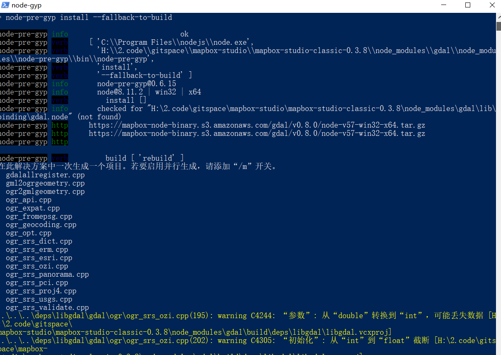

# 下载0.38版本
1、复制pacaage.json中的tgz路径，从浏览器下载下载来，将http路径修改为file即可  
2、yaml的github路径有变化，修改为https://github.com/springmeyer/js-yaml/tarball/master  
3、需使用python2.x版本编译    
4、error MSB4132: 无法识别工具版本“2.0”。可用的工具版本为 "4.0"   
使用命令：   
+ npm install --global --production windows-build-tools    
+ npm config set msvs_version 2015 --global  
+ npm install -g node-gyp   
5、 使用npm list 补全缺失的包  
   
